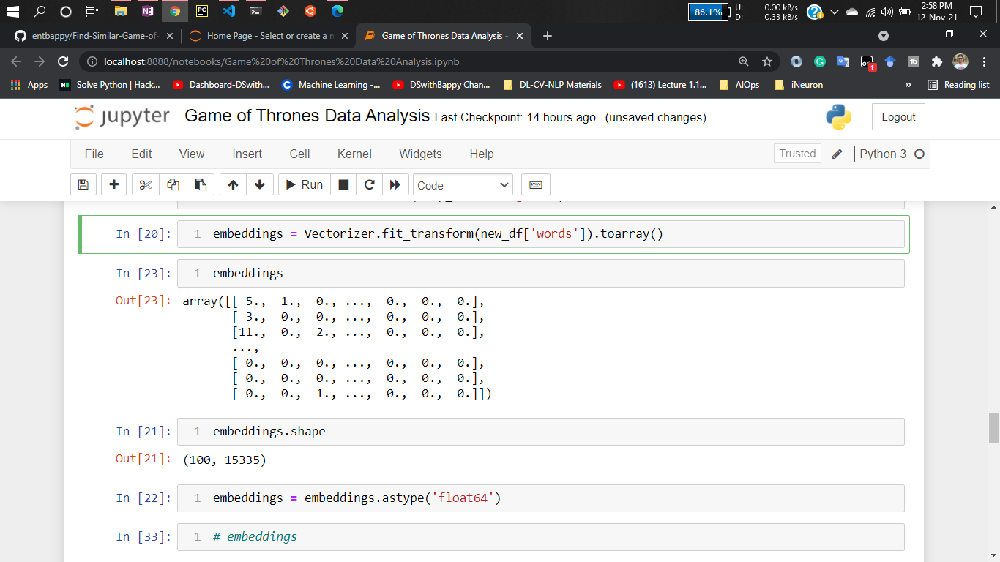
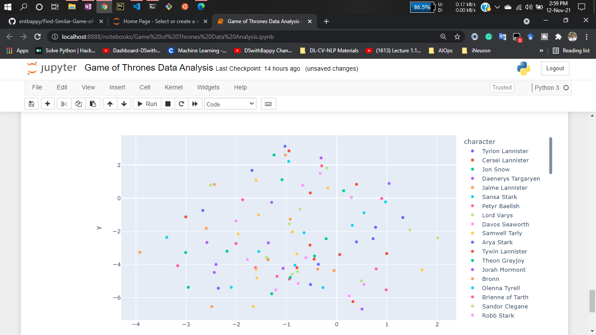
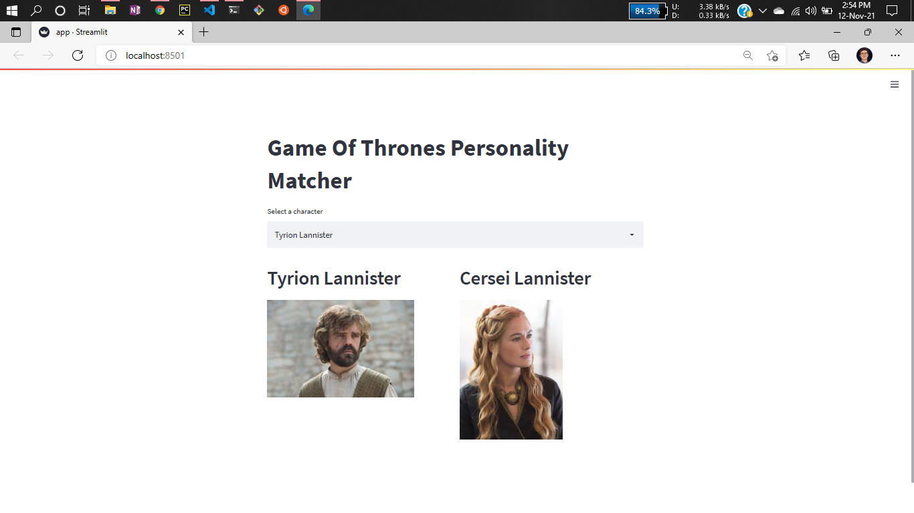
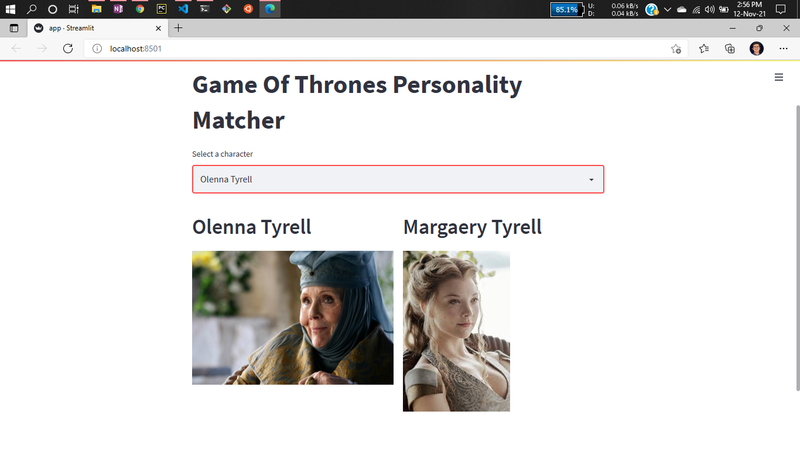
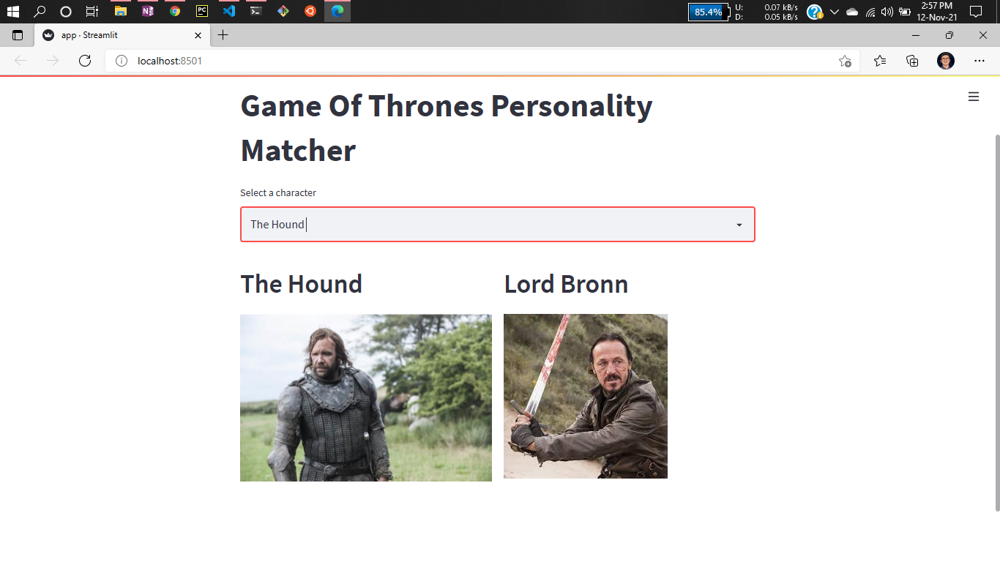

# Project: Find Similar Game of Thrones Character Using Machine Learning 


Nine noble families wage war against each other in order to gain control over the mythical land of Westeros. Meanwhile, a force is rising after millenniums and threatens the existence of living men.

First episode date: April 17, 2011

Created by: David Benioff; D. B. Weiss

Genre: Fantasy; Serial drama; Tragedy;

Awards: Primetime Emmy Award for Outstanding Drama Series, MORE

Adapted from: A Song of Ice and Fire, A Game of Thrones

Game of Thrones has a large ensemble cast and follows several story arcs throughout the course of the show. The first major arc concerns the Iron Throne of the Seven Kingdoms of Westeros through a web of political conflicts among the noble families either vying to claim the throne or fighting for independence from whoever sits on it. A second focuses on the last descendant of the realm's deposed ruling dynasty, who has been exiled to Essos and is plotting to return and reclaim the throne. The third follows the Night's Watch, a military order defending the realm against threats from beyond Westeros's northern border.


## About this project :

This is a streamlit web application that can find similar Game of Thrones Character. If you have already watched this series you should probably see some of character of this series are similar to each others.
here is a demo,


Here user has selected Petyr Baelish & this application is predicting the similar character of it as Varys.
It is great!! 😀

## How did i get the idea?

This is an interesting thought, Actually this idea came from dimentionality reduction technique.
I was exploring how to visualize higher dimensional data then i got to know about t-SNE (Stochastic Neighbor Embedding)

Visualization of high-dimensional data is an important problem in many different domains, and deals with data of widely varying dimensionality. Cell nuclei that are relevant to breast cancer, for example, are described by approximately 30 variables (Street et al., 1993), whereas the pixel intensity vectors used to represent images or the word-count vectors used to represent documents typically have thousands of dimensions. Over the last few decades, a variety of techniques for the visualization of such high-dimensional data have been proposed, many of which are reviewed by de Oliveira and Levkowitz (2003).

Important techniques include iconographic displays such as Chernoff faces (Chernoff, 1973), pixel-based techniques (Keim, 2000), and techniques that represent the dimensions in the data as vertices in a graph (Battista et al., 1994). Most of these techniques simply provide tools to display more than two data dimensions, and leave the interpretation of the data to the human observer. This severely limits the applicability of these techniques to real-world data sets that contain thousands of high-dimensional datapoints.

Researchers present a new technique called “t-SNE” that visualizes high-dimensional data by giving each datapoint a location in a two or three-dimensional map.

I have done some experimentation of this Algorithm:

Here I have used MNIST Handwritten dataset. You can see it is a higher dimentional data


After applying the algorithm you can see the result & visualization. It is still represented those data point in lower dimensional space. You can also see the similar features are very close to each other like 7 is very close to 1 if you consider the features.


More about how to visualize higher dimensional data:
 - [How to visualize higher dimensional data](https://github.com/entbappy/Visualizing-High-Dimensional-Data-using-t-SNE)


## Implementation of this project:

So as you have already seen how i got the idea. I did the same thing to figure out similar character by using The Ultimate Game of Thrones Dataset from kaggle. Its a dataset that contains all the characters dialouge given in that series. I have done counterVectorizer on this text data for converting to numerical representation then applied t-SNE on top of that. 
experimentation,



You can see the higher dimensional data poins. But after applying t-SNE it is still represented
same features & characters.



You can see the similar characters are very close to each other.

## Dataset has been used:

Note: Only use script-bag-of-words.json file

- [Dataset Link](https://www.kaggle.com/mathurinache/game-of-thrones-data?select=script-bag-of-words.json)


## Some demo:









# How to run?
### STEPS:

Clone the repository

```bash
git clone https://github.com/entbappy/Find-Similar-Game-of-Thrones-Character-Using-Machine-Learning.git
```
### STEP 01- Create a conda environment after opening the repository

```bash
conda create -n character python=3.7.10 -y
```

```bash
conda activate character
```


### STEP 02- install the requirements
```bash
pip install -r requirements.txt
```

Now run,
```bash
streamlit run app.py
```


```bash
Author: Bappy Ahmed
Data Scientist
Email: entbappy73@gmail.com

```

